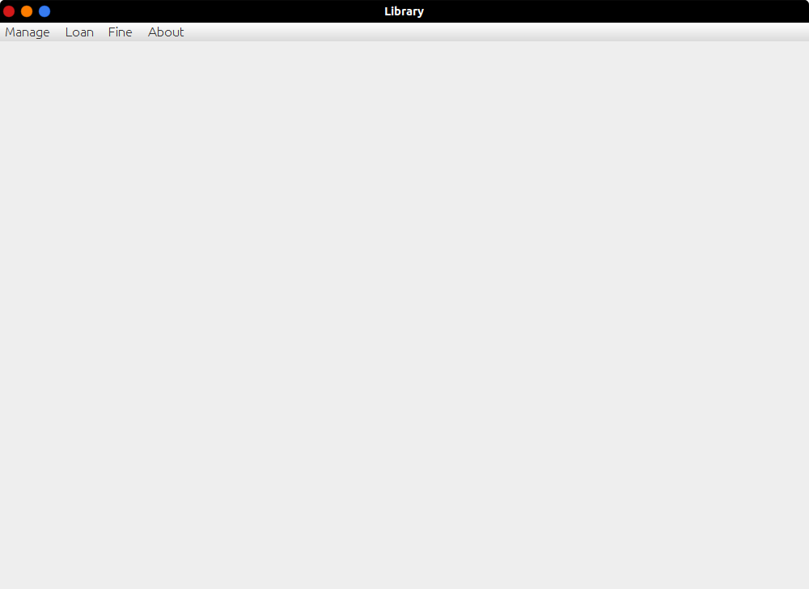
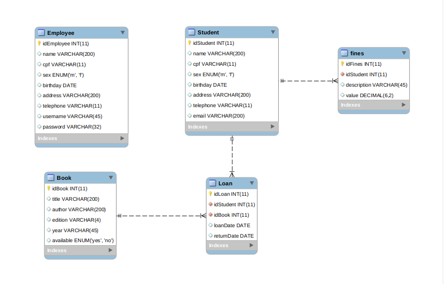
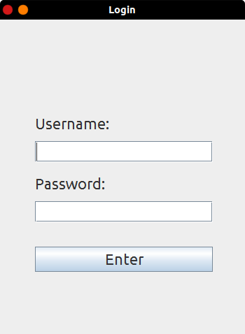
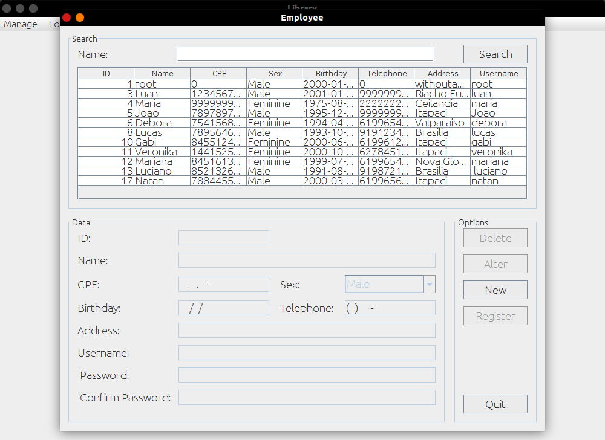
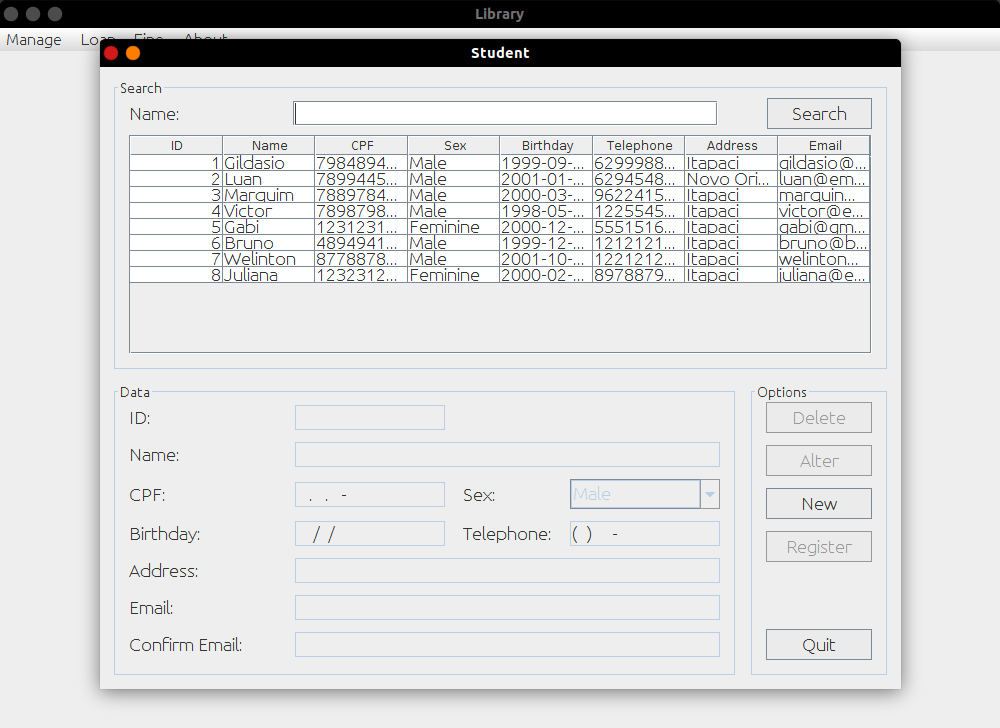
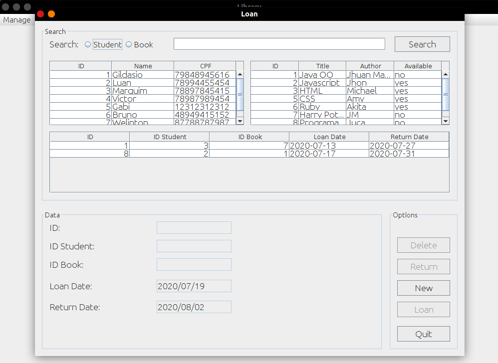
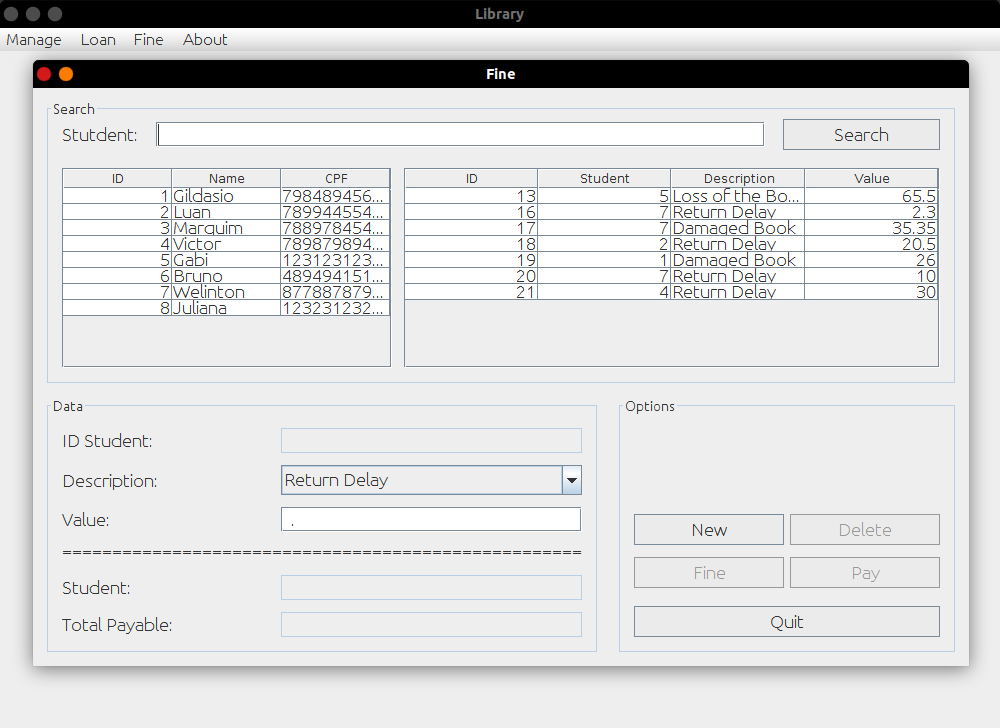

<h1 align="center">
  
  <br>Library<br>
</h1>

<p align="center">
  <a href="https://github.com/hellowluan/">
    
  </a>
  <a href="#">
    
  </a>
  <a href="#">
    
  </a>
</p>

<p align="center">
  <a href="https://www.linkedin.com/in/hellowluan/" target="_blank">
    
  </a>
</p>

<div align="center">
  <p align="center">
  <a href="#thinking-about">About</a>&nbsp;&nbsp;&nbsp;|&nbsp;&nbsp;&nbsp;
  <a href="#rocket-technologies">Technologies</a>&nbsp;&nbsp;&nbsp;|&nbsp;&nbsp;&nbsp;
  <a href="#camera-screenshots">Screenshots</a>&nbsp;&nbsp;&nbsp;|&nbsp;&nbsp;&nbsp;
  <a href="#user-content--contributing">Contributing</a>&nbsp;&nbsp;&nbsp;|&nbsp;&nbsp;&nbsp;
  <a href="#memo-license">License</a>
</p>
  
</div>

## :thinking: About

This system was made in order to learn about software development, put the contents into pratice:

- **UML**
- **MVC**
- **Database**
- **Object Oriented Programming**

To write commit messages, I used [Conventional Commits](https://www.conventionalcommits.org/pt-br/v1.0.0-beta.4/).

This system can and should be used in a library.

If you want to modify, redo, share or sell read the License.

### 🔐 Login

By default to login use:

- **Username:** root

- **Password:** toor


### 🛑 Disclaimer

- Icon made by [Smashicons](https://smashicons.com/) from [Flaticon](https://www.flaticon.com/)

- System inspired by [Projeto Biblioteca Java](https://github.com/paulojp-dev/projeto-biblioteca-java) made by [PauloJP-DEV](https://github.com/paulojp-dev) 

## :rocket: Technologies

Developed with the following technologies:

- [Java-8](https://www.java.com/pt_BR/download/)
- [MySQL](https://www.java.com/pt_BR/download/)

## :camera: Screenshots 

### 🎲 Database



### 💻 System










- 🎥 [Click here](https://www.youtube.com/watch?v=r37m0exstx0) to watch video of the system working.

## 💁🏻 Contributing

1. Fork it
2. Create your feature branch: ```$ git checkout -b new-branch```
3. Commit your changes: ```$ git commit -am 'Add some feature'```
4. Push to the branch: ```$ git push origin new-branch```
5. Submit a pull request :D

## :memo: License

This repository was made for study purposes. For more information, read the [LICENSE](LICENSE).

made with ❤ by Luan Mateus